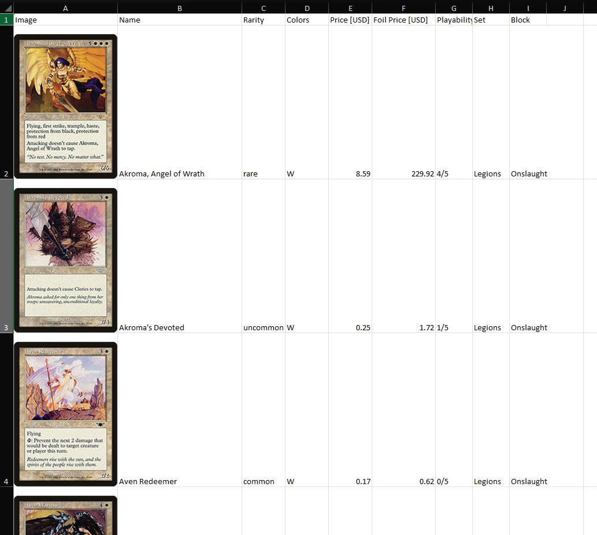

# Magic the Gathering Spreadsheet Generator

This script generates Excel spreadsheets of magic cards with relevant columns such as image, name, color, cost, and playability.

This is designed for use in evaluating a collection of cards that are sorted by set, color, and name: quickly scan and see what's valuable or playable.

To use this command line tool, you will need to install Python and run the script. It will download data from the excellent https://mtgjson.com, pull images from https://scryfall.com, and write out a Microsoft Excel (XLSX) file.

## Setup
* Install Python https://www.python.org
* Download or check out this code.
* Open a terminal in this folder.
* Install required libraries: `pip install -r requirements.txt`

## Usage
* Open a terminal in this folder.
* See all available commands and options: `python run.py --help`
* Print the list of sets: `python run.py --print_sets`
* Make a spreadsheet for the set or block named "Onslaught": `python run.py Onslaught`
* Find the generated spreadsheet in this folder, and open it using Microsoft Excel.

## Example

